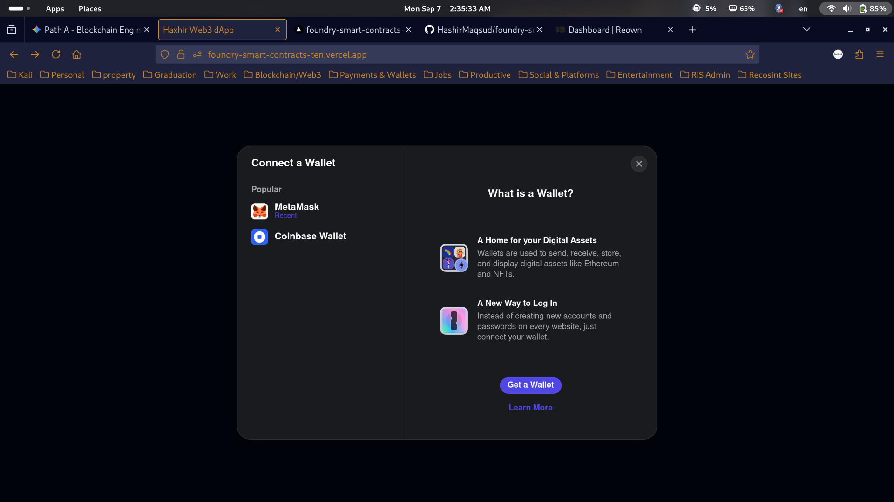
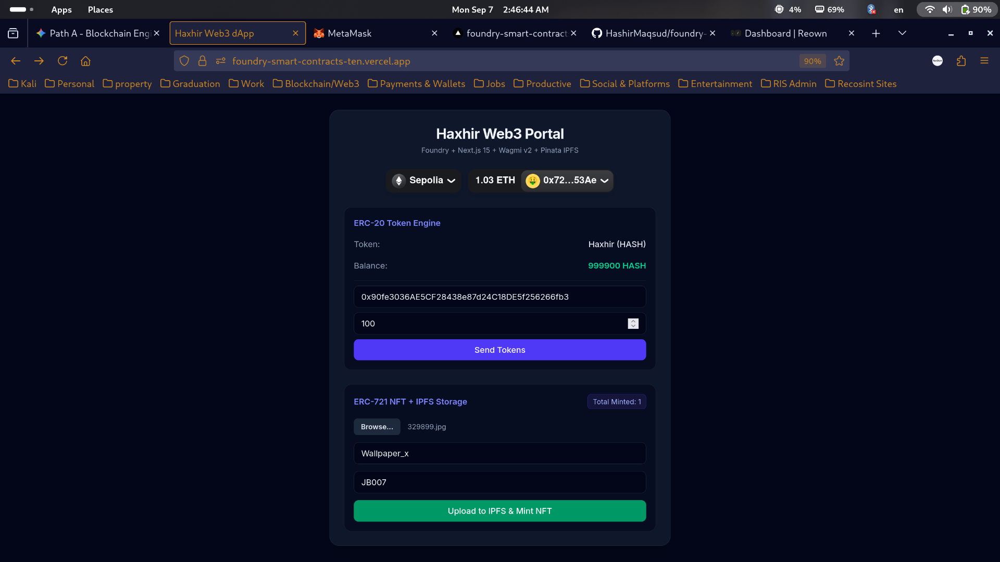
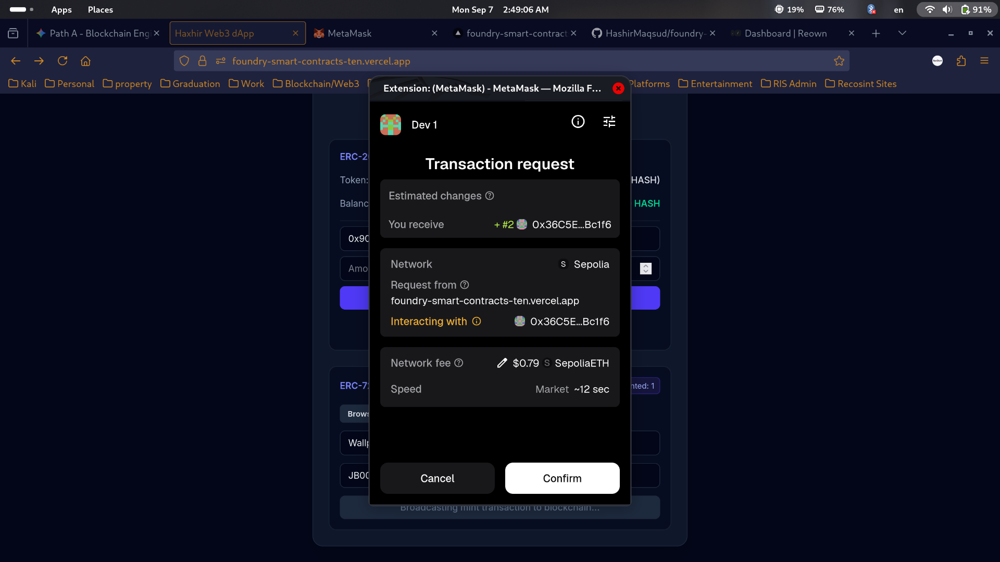
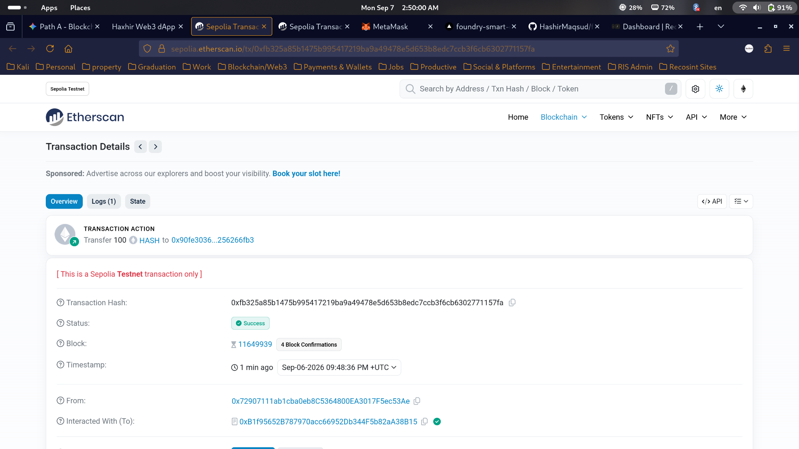

# Full-Stack Web3 dApp: ERC-20, ERC-721, IPFS & Advanced Security Suite

A production-grade decentralized application built with Foundry, Next.js 15, RainbowKit, Wagmi v2, Viem, and Pinata IPFS. The ecosystem integrates a complete smart contract security verification pipeline—spanning Slither static analysis, Foundry property-based fuzz testing, and simulated reentrancy exploit defense—deployed on the Ethereum Sepolia testnet.

> ** Live Application Demo:** [haxhir-web3-dapp.vercel.app](https://foundry-smart-contracts-ten.vercel.app)

---






---

## ⚡ Quick Interaction Guide
- **Network:** Ethereum Sepolia Testnet
- **NFT Minting:** Requires Sepolia ETH for gas. Any valid image (`png`, `jpeg`, `webp`, `gif`) will upload to Pinata IPFS and execute on-chain minting.
- **ERC-20 Token Transfers:** The initial token supply is allocated to the deployer address. To test transfers:
  1. Mint an NFT directly using your Sepolia wallet.
  2. For token transfers, contact the deployer address or request testnet `$HASH` tokens: `0x72...53Ae`

---

## Verified Smart Contracts (Ethereum Sepolia)

All smart contracts have been compiled using Foundry, statically audited with Slither, deployed to the Sepolia testnet, and fully verified on Etherscan and Sourcify.

| Contract | Type | Etherscan Verification |
| :--- | :--- | :--- |
| **HaxhirToken** | ERC-20 | [](https://sepolia.etherscan.io/address/0xb1f95652b787970acc66952db344f5b82aa38b15#code) |
| **HaxhirNFT** | ERC-721 | [](https://sepolia.etherscan.io/address/0x36c5e35dbf75097478a82233a33199c8069bc1f6#code) |

> **Interactive ABI:** Interact with state methods (minting, balances, token URIs) directly through the **"Read Contract"** and **"Write Contract"** tabs on Etherscan using your Web3 wallet.

---

## Architectural Overview

This system operates without a centralized backend server. Client interactions interface directly with on-chain smart contracts through RPC nodes, while digital assets and metadata are preserved using decentralized IPFS storage protocols.

```text
Browser Client (Next.js 15 + Wagmi v2 + Viem)
|
+---> Pinata API / IPFS (Asset & Metadata Storage)
|
+---> Ethereum Sepolia RPC (EVM State Execution)
|
+---> HaxhirToken (ERC-20) [Audited V2]
+---> HaxhirNFT (ERC-721)  [Audited V2]

```

---

## Security Auditing & Verification Pipeline

Prior to production deployment, all contracts underwent a rigorous 3-tier security validation lifecycle:

```text
[ Tier 1: Static Analysis ] ---> [ Tier 2: Property Fuzzing ] ---> [ Tier 3: Exploit Lab & Defense ]
(Slither)                           (Foundry)                    (Reentrancy & CEI Guard)

```

### 1. Static Analysis (Slither AST Scanning)

* Scanned contracts using Slither AST analyzers for common vulnerabilities (state variable shadowing, uninitialized state, reentrancy vulnerabilities, arbitrary send).
* Remediation: Resolved variable shadowing on inherited state variables and enforced strict state ordering across the codebase.
* **Audit Result:** 0 critical, 0 high, 0 medium findings.

### 2. Property-Based Fuzz Testing (Foundry)

* Tested contract properties and edge cases over **256 randomized runs per function** with boundary condition fuzzing (e.g., 0, 1, 2^256 - 1, randomized recipient addresses).
* **HaxhirToken Tests:**
* `testFuzz_TransferValidAmount`: Invariant check ensuring balance consistency across random valid amounts.
* `testFuzz_RevertWhenTransferExceedsBalance`: Strict revert validation when random input exceeds caller balance.
* `testFuzz_TransferBetweenRandomUsers`: Random recipient and amount handling with zero-address discarding via `vm.assume`.


* **HaxhirNFT Tests:**
* `testFuzz_MintNFT`: Randomized recipient generation and URI string assignment verifying total supply invariants and token ownership.


### 3. Reentrancy Exploit & Defense Lab

* Implemented an exploit proof-of-concept (`contracts/src/security-labs/`):
* **`VulnerableBank.sol`**: State balance updated *after* external raw call execution (violating CEI).
* **`Attacker.sol`**: Malicious contract triggering a recursive fallback loop to drain the bank.
* **`SafeBank.sol`**: Implemented OpenZeppelin's `ReentrancyGuard` (`nonReentrant`) and the Checks-Effects-Interactions (CEI) design pattern.


* Automated tests mathematically verified both the 11 ETH bank drain attack and the subsequent revert defense on `SafeBank`.

---

## Tech Stack

* **Smart Contracts:** Solidity `^0.8.20`, Foundry (`forge`, `anvil`), Slither, OpenZeppelin.
* **Frontend & Web3 Bridge:** Next.js 15, React 19, TypeScript, Tailwind CSS, RainbowKit, Wagmi v2, Viem.
* **Infrastructure:** Vercel (Edge-optimized), Pinata SDK (Decentralized IPFS pinning).

---

## Local Development & Setup

### Prerequisites

* Node.js `>= 18.x`
* Foundry toolchain (`forge`, `anvil`, `cast`)
* Python 3.x with Slither installed (`pip3 install slither-analyzer`)
* MetaMask browser extension

### 1. Smart Contracts Setup & Testing

```bash
cd contracts

# Install dependencies
forge install OpenZeppelin/openzeppelin-contracts --no-commit

# Run all unit and fuzz tests
forge test -vv

# Run the Reentrancy Exploit & Defense Lab
forge test --match-path test/security-labs/ReentrancyExploit.t.sol -vv

# Run Slither static analysis
slither . --config-file slither.config.json

```

### 2. Frontend Setup

```bash
cd frontend

# Install dependencies
npm install

# Set environment variables
cp .env.example .env.local

```

Add your Pinata credentials inside `frontend/.env.local`:

```env
NEXT_PUBLIC_PINATA_JWT=your_pinata_jwt
NEXT_PUBLIC_GATEWAY_URL=gateway.pinata.cloud

```

Run the development server:

```bash
npm run dev

```